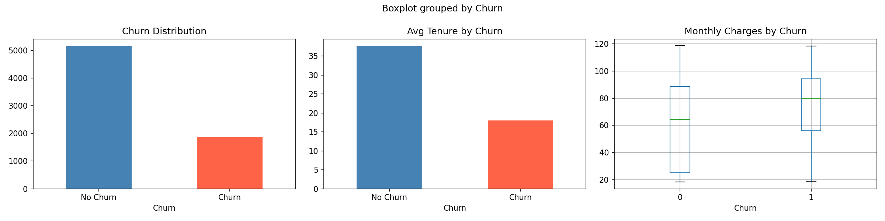
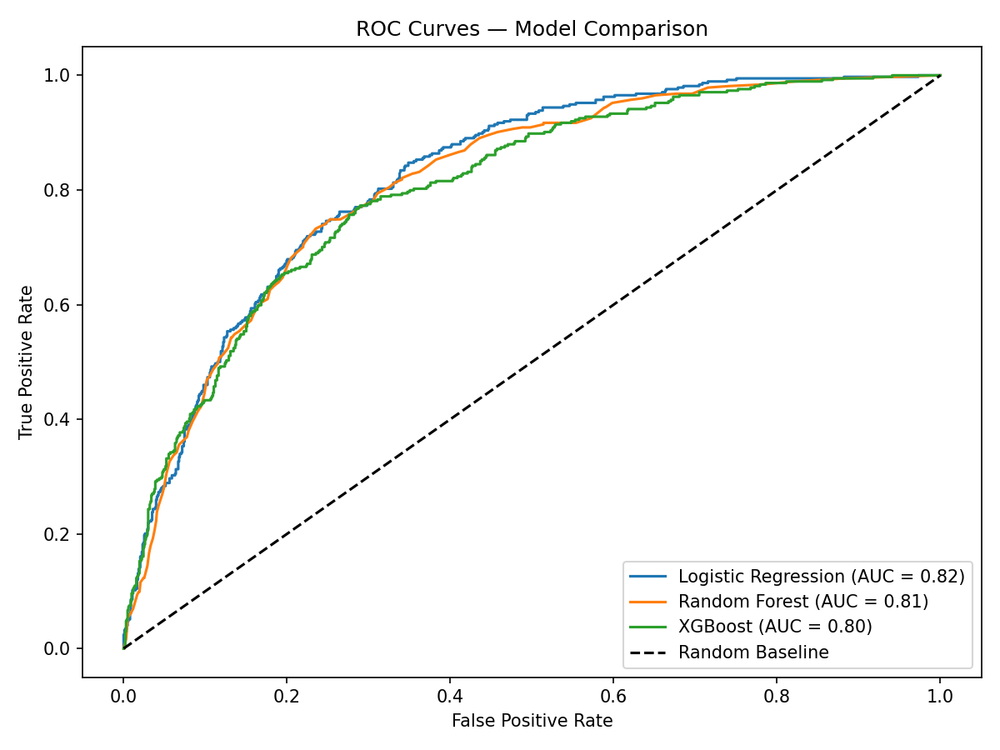
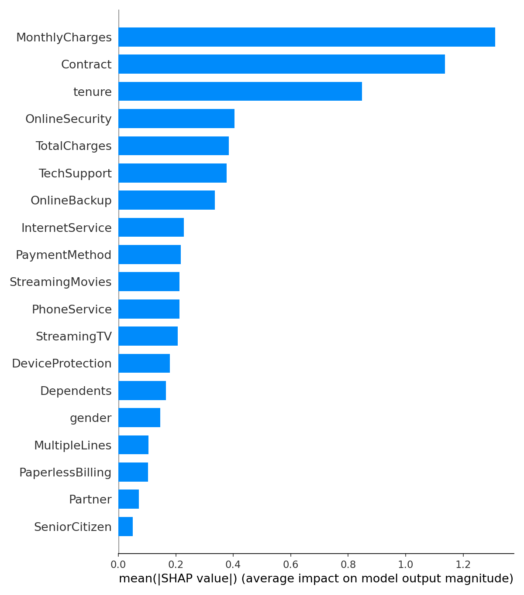
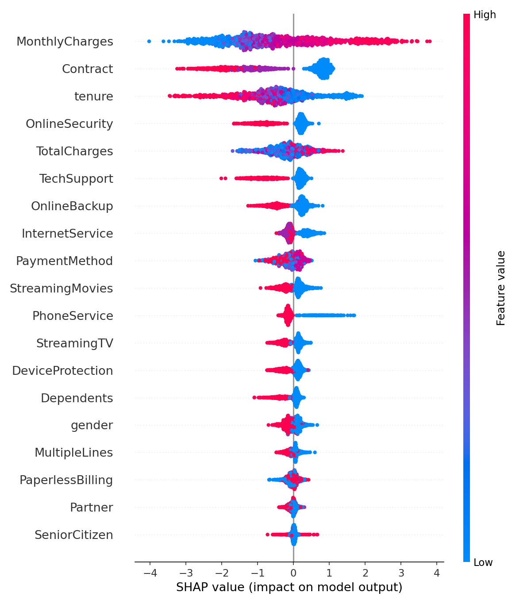
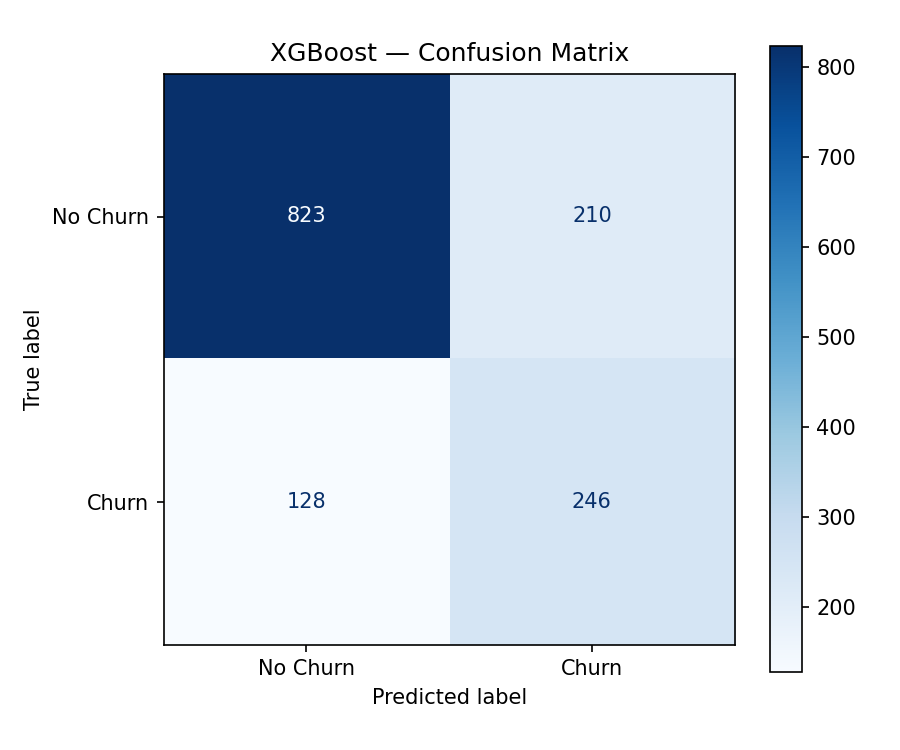

# 📉 Customer Churn Prediction
> Predicting which telecom customers are likely to cancel their subscription — before they do.

---

## 🧠 Problem Statement

Customer churn is one of the most expensive problems in business. Acquiring a new customer costs **5x more** than retaining an existing one. This project builds a machine learning pipeline that identifies at-risk customers early, giving retention teams time to intervene with targeted offers.

**Dataset:** [Telco Customer Churn](https://www.kaggle.com/datasets/blastchar/telco-customer-churn) — 7,032 customers, 20 features

---

## 🏆 Results

| Model | Accuracy | Recall (Churn) | AUC Score |
|---|---|---|---|
| **Logistic Regression** | **74%** | **75%** | **0.8229 ✅ Best** |
| Random Forest | 76% | 64% | 0.8131 |
| XGBoost | 76% | 66% | 0.8041 |

> **Logistic Regression outperformed more complex models**, suggesting churn patterns in this dataset are largely linear. This highlights that model complexity doesn't always equal better performance.

---

## 📊 Key Visualizations

### Churn Distribution & EDA


### ROC Curve — Model Comparison


### SHAP Feature Importance


### SHAP Detailed Impact


### Confusion Matrix (Best Model)


---

## 🔍 Key Findings

From SHAP analysis, the top drivers of churn were:

1. **Contract type** — Month-to-month customers churn significantly more than 1 or 2-year contract holders
2. **Tenure** — Newer customers (< 12 months) are at much higher risk
3. **Monthly charges** — Customers paying above average monthly bills churn more frequently

> **Business insight:** Offering long-term contracts or loyalty discounts to new high-paying customers would likely reduce churn the most.

---

## 🛠️ Tech Stack

| Category | Tools |
|---|---|
| Language | Python 3.12 |
| Data Processing | pandas, NumPy |
| Visualization | Matplotlib, Seaborn |
| Machine Learning | scikit-learn, XGBoost |
| Class Balancing | imbalanced-learn (SMOTE) |
| Explainability | SHAP |
| Environment | Jupyter Notebook / Google Colab |

---

## 🔄 Project Pipeline
```
Raw CSV Data
    ↓
Data Cleaning
(fix TotalCharges type, drop nulls, encode Churn)
    ↓
EDA & Visualization
(churn distribution, tenure, monthly charges)
    ↓
Feature Engineering
(label encoding, standard scaling)
    ↓
Train/Test Split (80/20, stratified)
    ↓
SMOTE (balance training data 50/50)
    ↓
Train 3 Models
(Logistic Regression, Random Forest, XGBoost)
    ↓
Evaluate
(Accuracy, Recall, F1, AUC, ROC Curve)
    ↓
Explain with SHAP
(feature importance + direction of impact)
```

---

## 📁 File Structure
```
customer-churn-prediction/
│
├── churn_prediction.ipynb   ← main notebook
├── README.md                ← this file
│
├── WA_Fn-UseC_-Telco-Customer-Churn.csv  ← dataset
│
└── images/
    ├── eda_plots.png
    ├── roc_curves.png
    ├── shap_importance.png
    ├── shap_detail.png
    └── confusion_matrix.png
```

---

## ▶️ How to Run
```bash
# 1. Clone the repo
git clone https://github.com/swejal22/customer-churn-prediction.git
cd customer-churn-prediction

# 2. Install dependencies
pip install pandas numpy matplotlib seaborn scikit-learn xgboost shap imbalanced-learn jupyter

# 3. Launch notebook
jupyter notebook churn_prediction.ipynb
```

---

## 💡 What I Learned

- **Class imbalance is critical** — without SMOTE, the model would have ignored churners entirely
- **Simpler models can win** — Logistic Regression outperformed XGBoost on this clean, linear dataset
- **Explainability matters** — SHAP revealed actionable business insights beyond just accuracy numbers
- **Recall > Accuracy** for churn — missing a real churner is more costly than a false alarm

---

## 👤 Author

**Swejal Gabhane**
M.S. Data Science — University of Colorado Boulder
[LinkedIn](https://linkedin.com) | [GitHub](https://github.com/swejal22)# customer-churn-prediction
